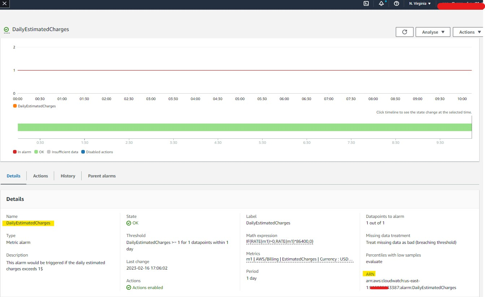
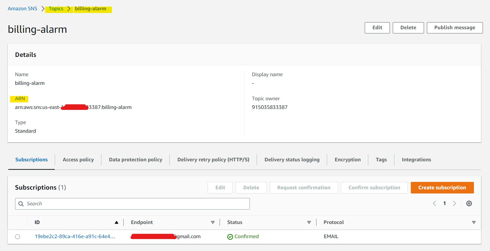
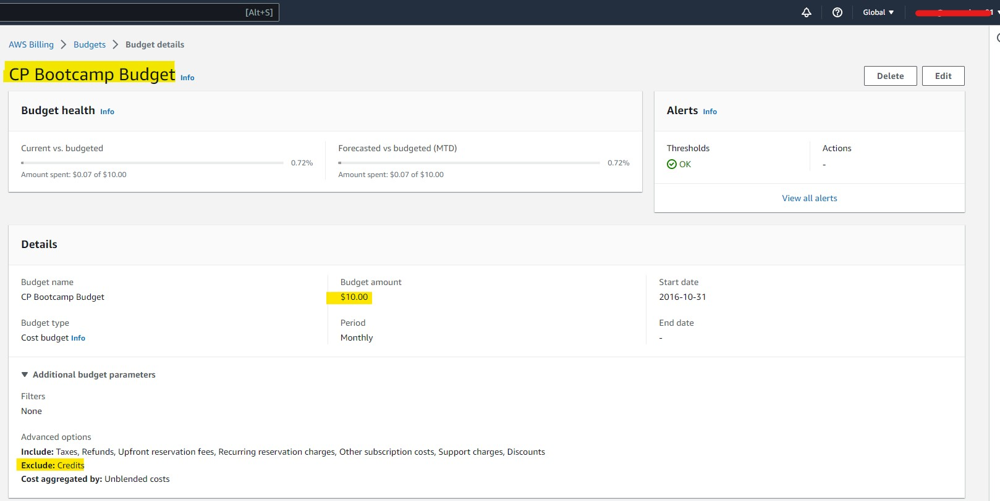
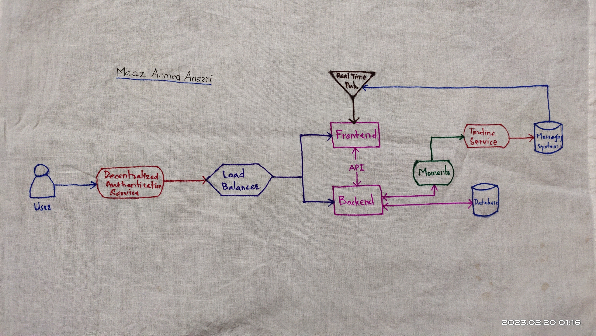
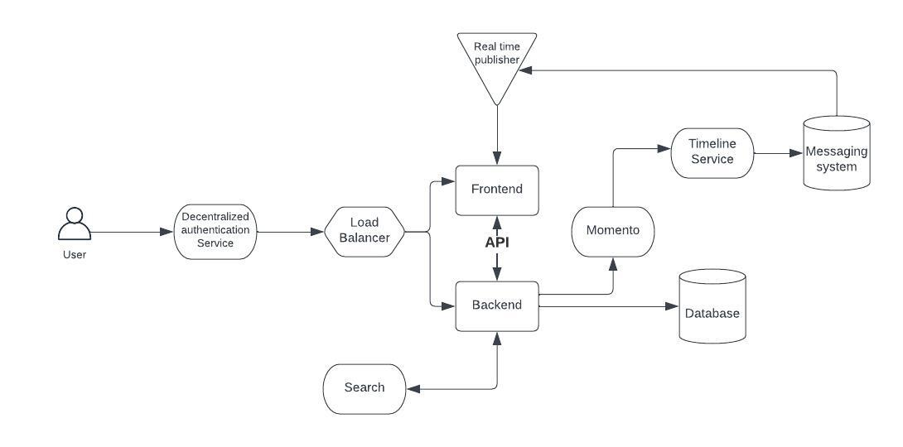
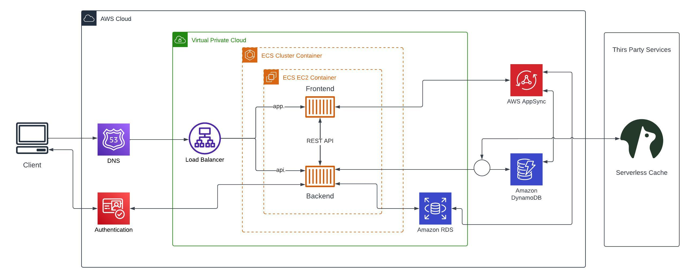
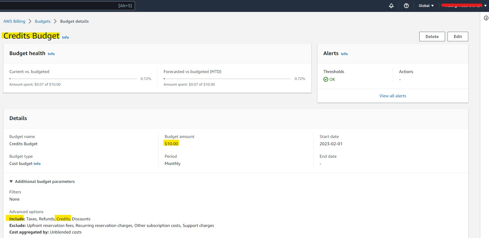
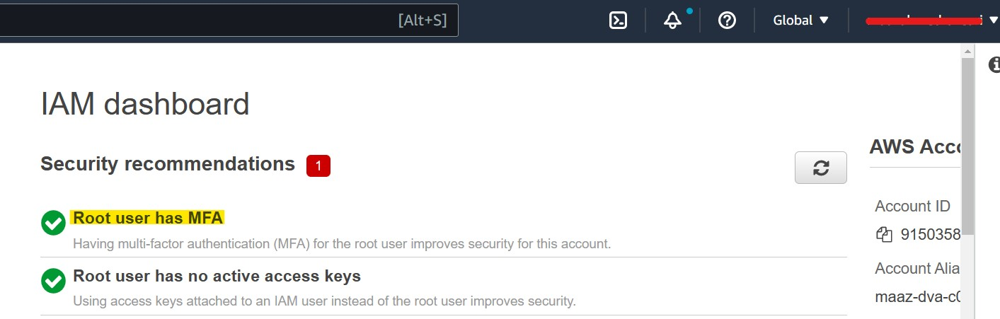

# Week 0 — Billing and Architecture

## Required Homework/Tasks

### Install and use AWS CLI in Gitpod

Integrated in [.gitpod.yml](https://github.com/maaz-ahmed-ansari/aws-bootcamp-cruddur-2023/blob/main/.gitpod.yml) so that it will be executes at start of Gitpod workspace.

### Create a Billing Alarm and SNS

Created Billing Alarm and integrated it with SNS

Billing Alarm Code [aws/json/alarm-config.json](https://github.com/maaz-ahmed-ansari/aws-bootcamp-cruddur-2023/blob/main/aws/json/alarm-config.json)

### Create a Budget

Created CP Bootcamp Budget for $10

CP Bootcamp Budget Code [aws/json/budget.json](https://github.com/maaz-ahmed-ansari/aws-bootcamp-cruddur-2023/blob/main/aws/json/budget.json)

### Recreate Conceptual Diagram on a **Napkin**

### Recreate Conceptual Diagram in Lucid Charts

[Lucid Chart (Conceptual Diagram) Shared Link](https://lucid.app/lucidchart/f447a4fa-60e9-4d57-8649-9831f8c752e2/edit?viewport_loc=-216%2C12%2C1311%2C576%2C0_0&invitationId=inv_2207f02e-0862-4314-bbc8-836d97b64a62)

### Recreate Logical Architecture Diagram

 

[Lucid Chart (Logical Architecture Diagram) Shared Link](https://lucid.app/lucidchart/7077d91e-09d6-48af-b873-85d2315e7099/edit?viewport_loc=-437%2C-1150%2C2624%2C1152%2C0_0&invitationId=inv_b540e295-08f7-4a76-bbf4-8172dade75ea)

## Homework Challanges

### Created additional Budget

Created one addidtional budget (viz. Credits Budget) including Credits, Taxes, Refunds and Discount. This budget is for AWS Credits.

Credits Budget Code [aws/json/additional-budget.json](https://github.com/maaz-ahmed-ansari/aws-bootcamp-cruddur-2023/blob/main/aws/json/additional-budget.json)

### MFA For Root Account

Created MFA For Root AWS Account

