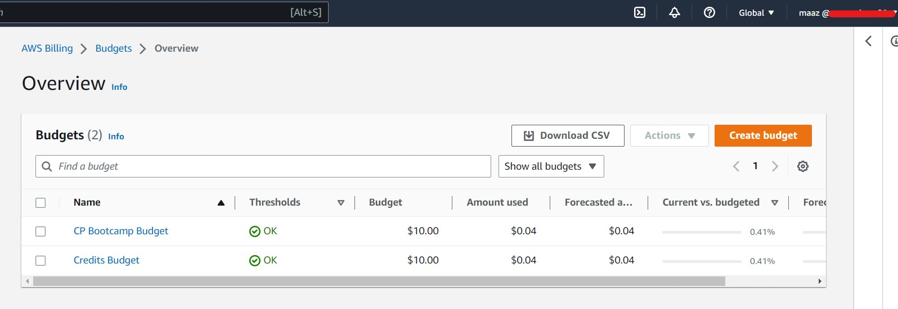

# Week 0 — Billing and Architecture

## Required Homework/Tasks

### Installed and used AWS CLI in Gitpod

Integrated in [.gitpod.yml](https://github.com/maaz-ahmed-ansari/aws-bootcamp-cruddur-2023/blob/main/.gitpod.yml) so that it will be executes at start of Gitpod workspace.

### Create a Billing Alarm and SNS

Created Billing Alarm and integrated it with SNS

### Create a Budget

Created two budgets, one including Credits (viz. CP Bootcamp Budget) and one including Credits (viz. Credits Budget) for $10 each

## Homework Challanges
