# Week 1 — App Containerization

## Required Homework/Tasks

### Containerize Application - Dockerfile Backend Flask

- Docker Run

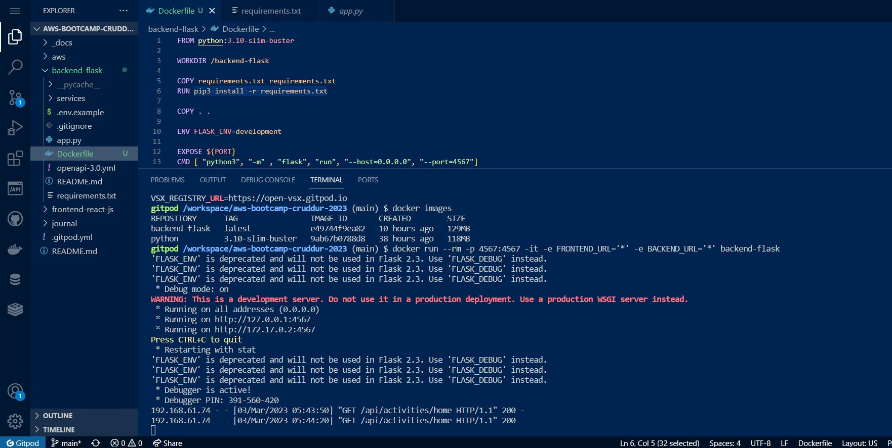

- Response on Port 4567

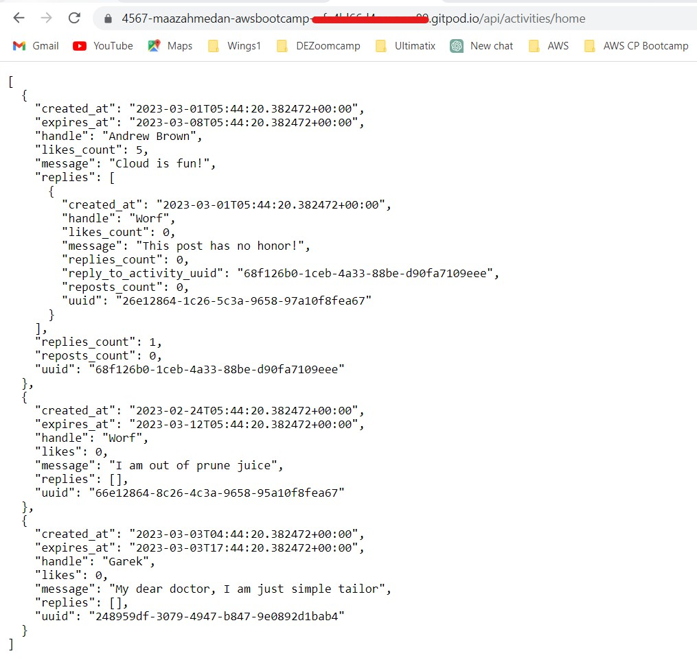

### Containerize Application - Dockerfile and NPM Install Frontend Flask

```npm i```

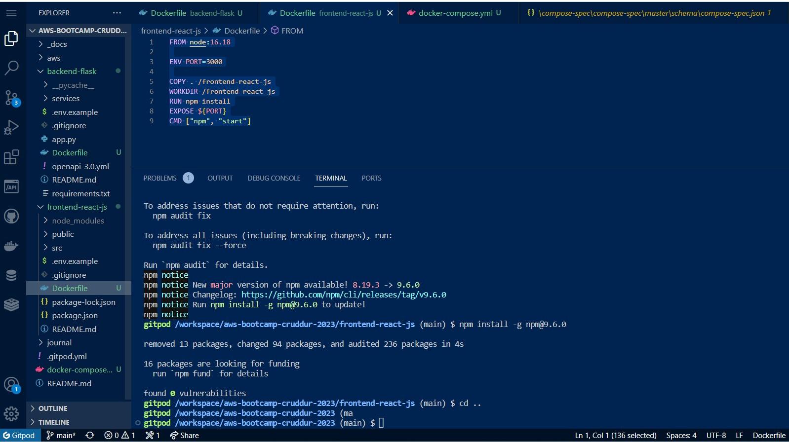

### Containerize Application - Docker Compose

- Docker Compose Up

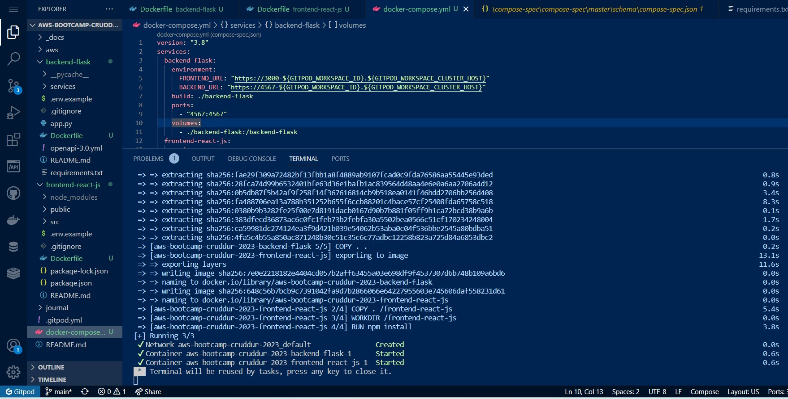

- Response on Port 3000

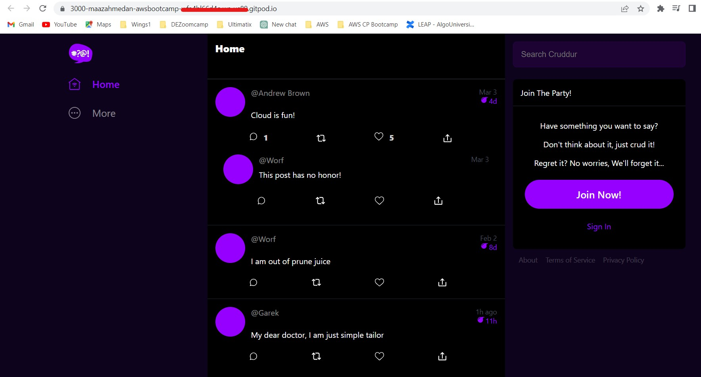

### Update Homepage of Crudder (i.e. home_activities.py)

- Update home_activities.py

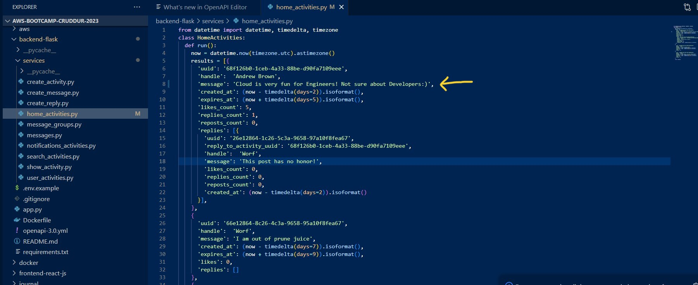

- Updated Homepage and Sign up on Crudder

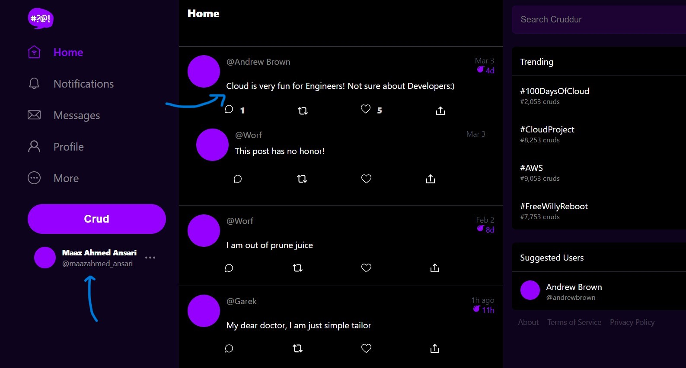

### Endpoint for Notifications

- Notification Endpoint on Backend Flask

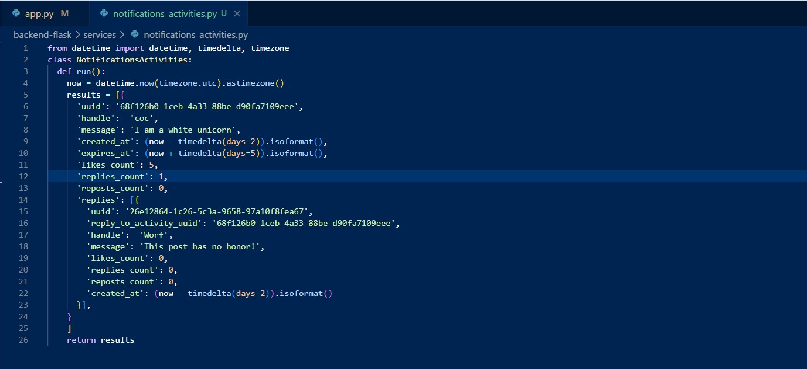

- Response on Port 4567

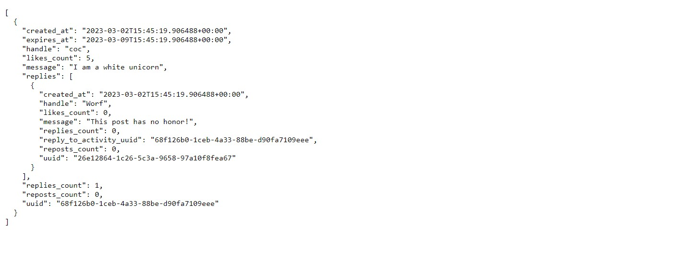

- Response on Port 3000

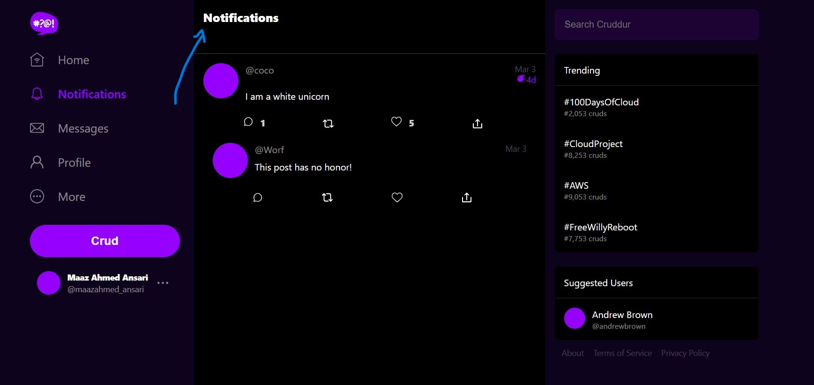

### Run DynamoDB Local Container

- Create DynamoDB Table

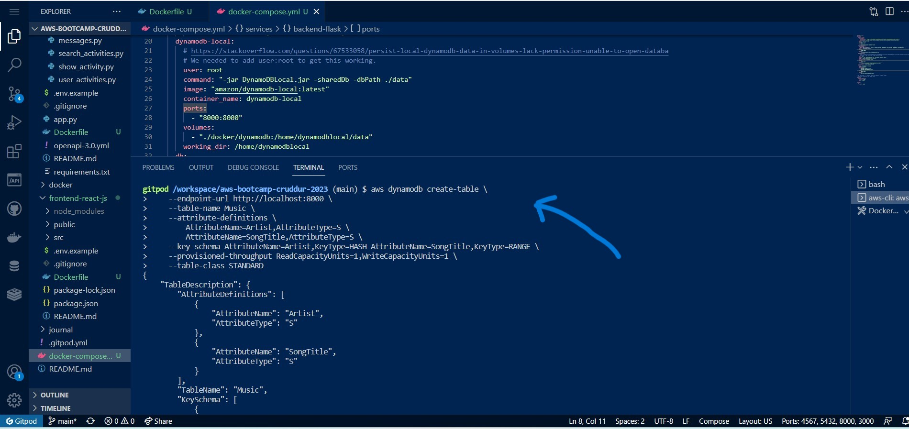

- Get Records

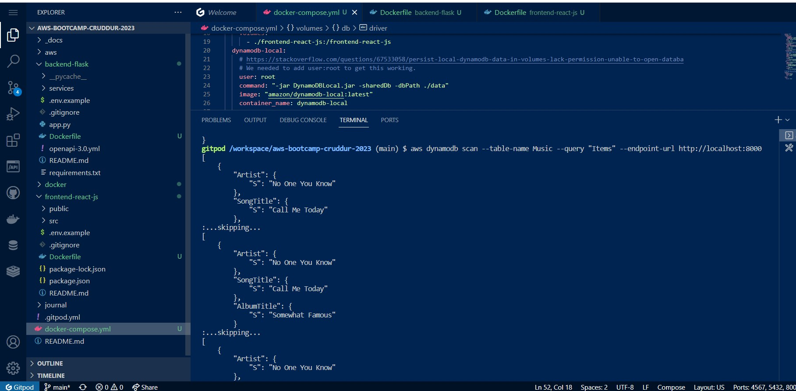

### Postgres Container

- Postgres Client

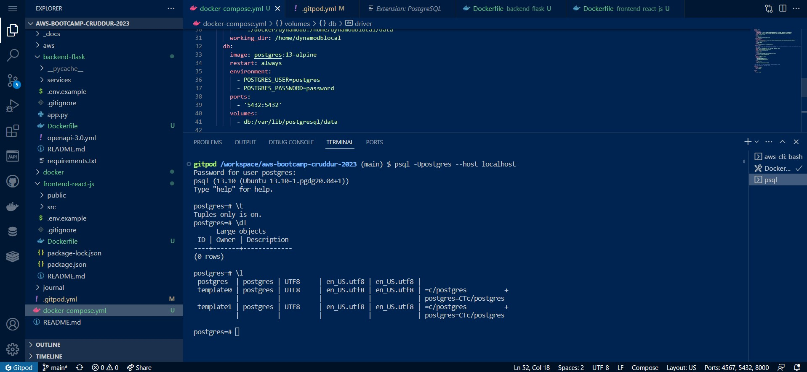
