# Week 2 — Distributed Tracing

## Instrument Honeycomb with OTEL 

- OTEL Environment Variables

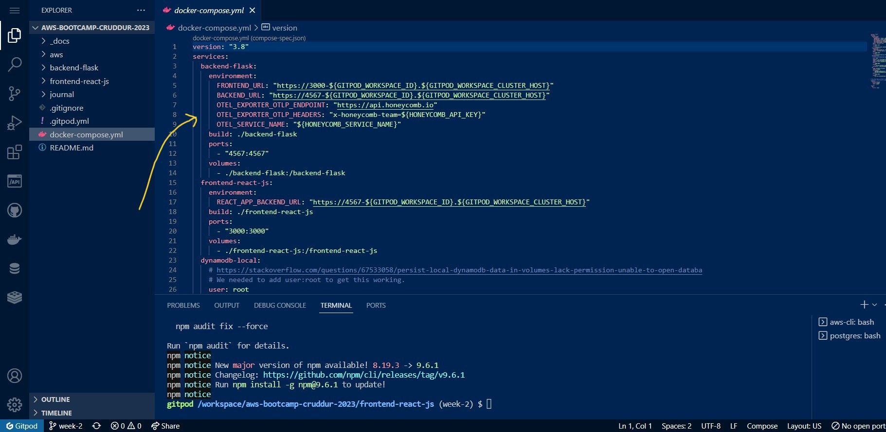

- Instrument in app.py

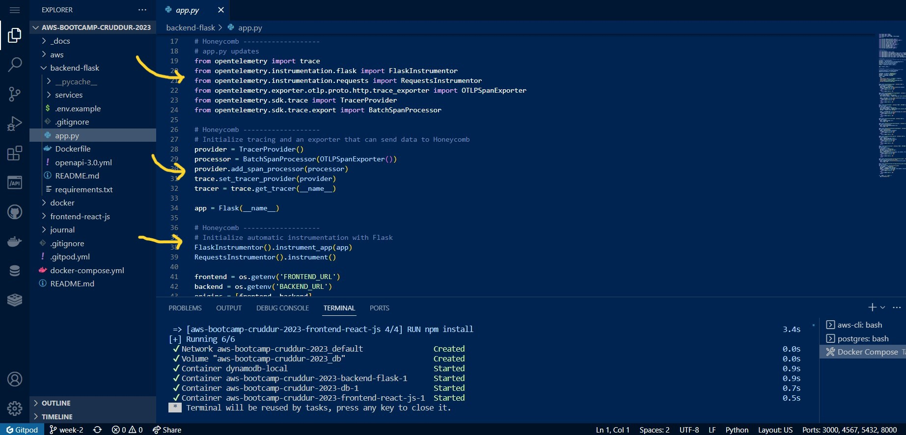

- Trace in Honeycomb UI

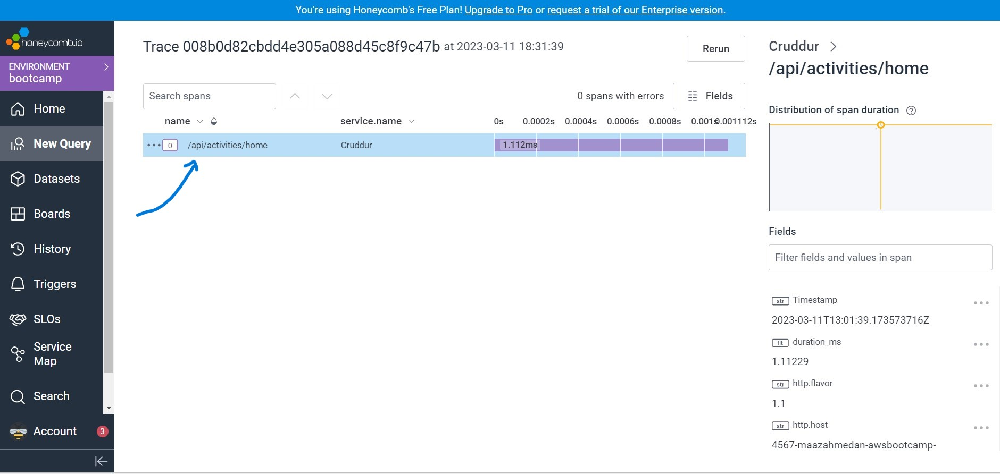

- Instrument **home-activities-mock-data span**

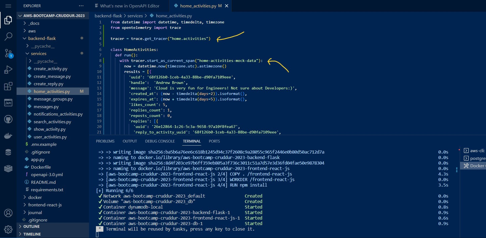

- home-activities-mock-data span in Honeycomb UI

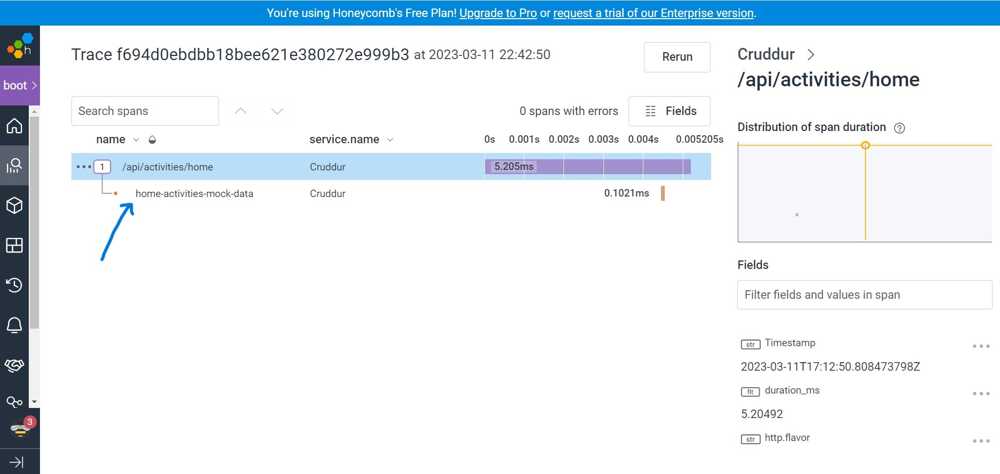

- Instrument **app.now** and **app.result_length attributes**

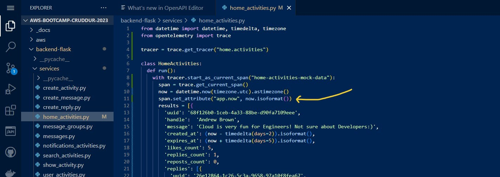

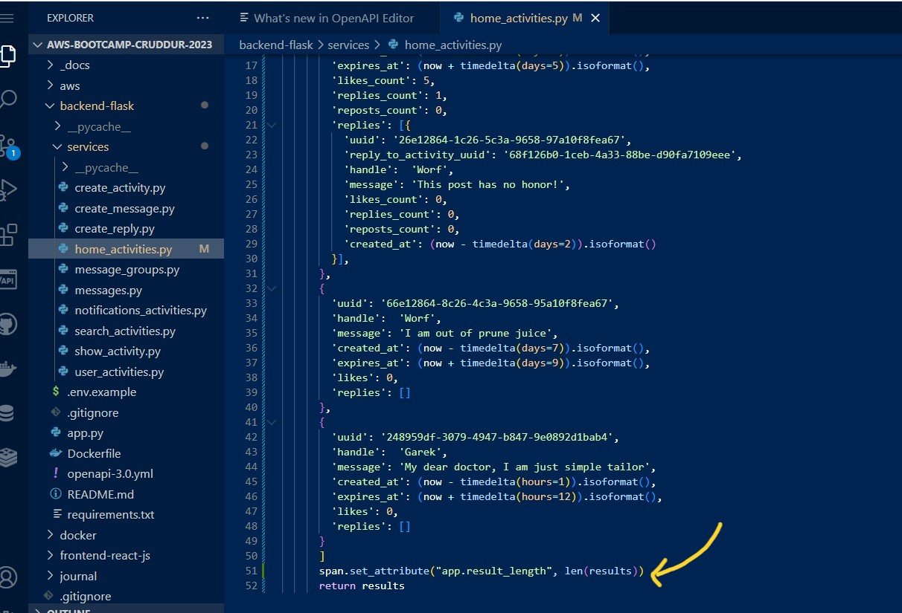

- **app.now** and **app.result_length** attributes in **Honeycomb UI**

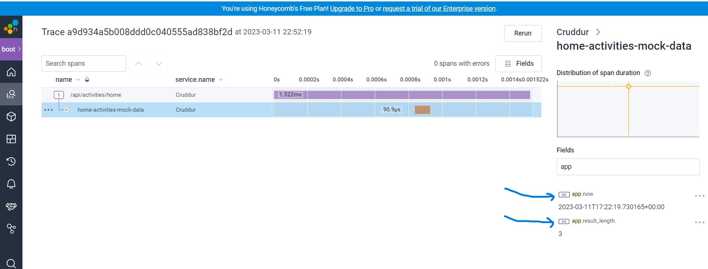

- **COUNT, MAX and HEATMAP Queries** in Honeycomb

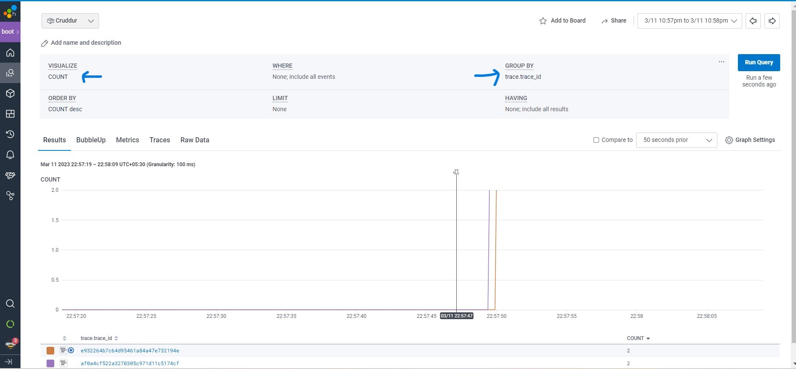

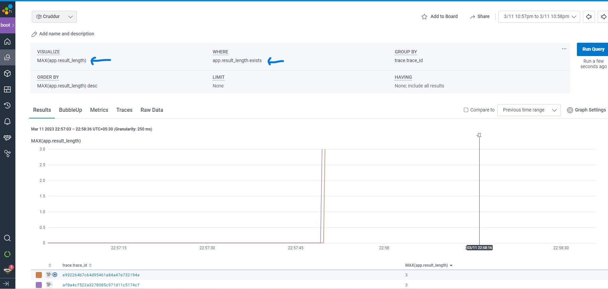

## Instrument AWS X-Ray

- Instrument AWS X-Ray

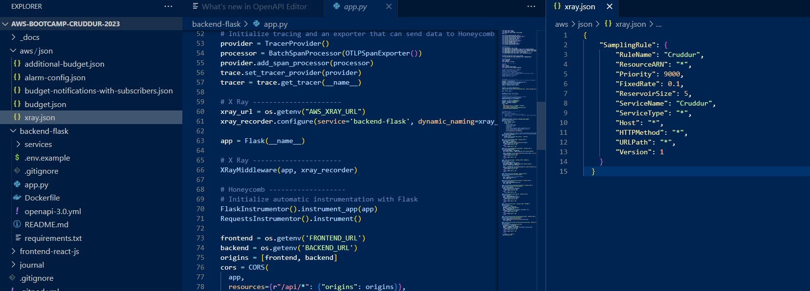

- X-Ray Group, Sampling rule and Traces

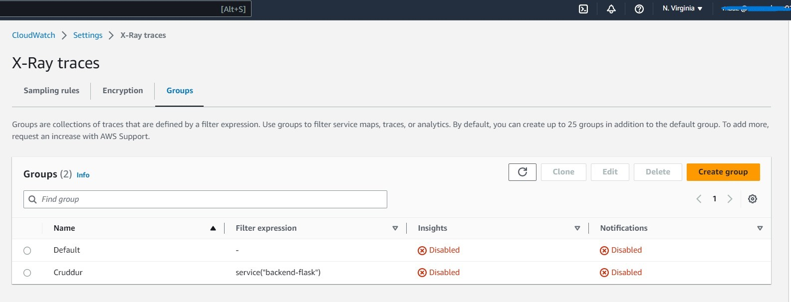

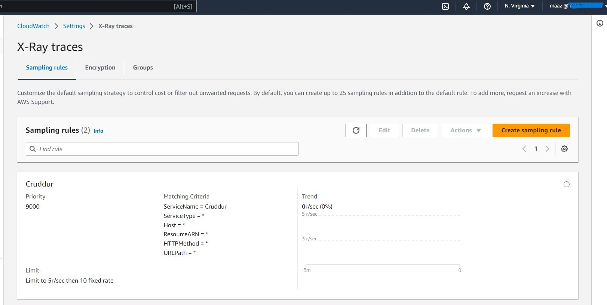

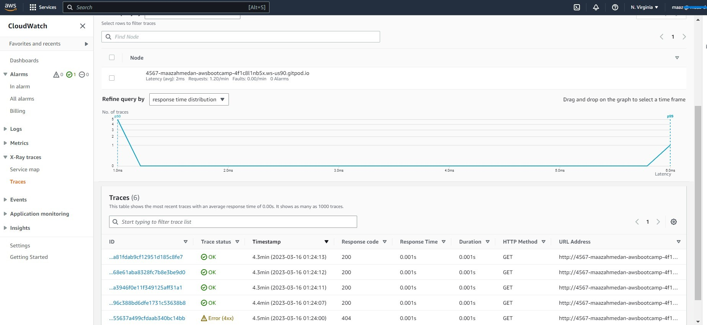

