# Week 2 — Distributed Tracing

## Instrument Honeycomb with OTEL 

- OTEL Environment Variables

- Instrument in app.py

- Trace in Honeycomb UI

- Instrument **home-activities-mock-data span**

- home-activities-mock-data span in Honeycomb UI

- Instrument **app.now** and **app.result_length attributes**

- **app.now** and **app.result_length** attributes in **Honeycomb UI**

- **COUNT, MAX and HEATMAP Queries** in Honeycomb

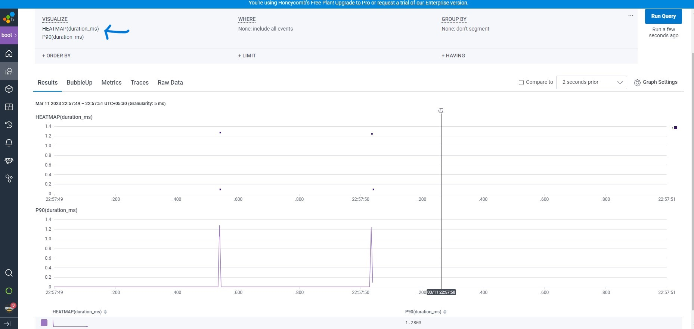

## Instrument AWS X-Ray

- Instrument AWS X-Ray

- X-Ray Group, Sampling rule, Traces and Trace Map

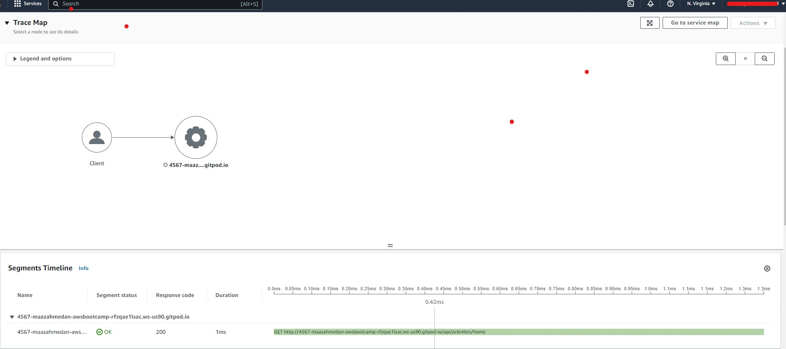

## AWS X-Ray Subsegments

- Instrument AWS X-Ray Subsegments

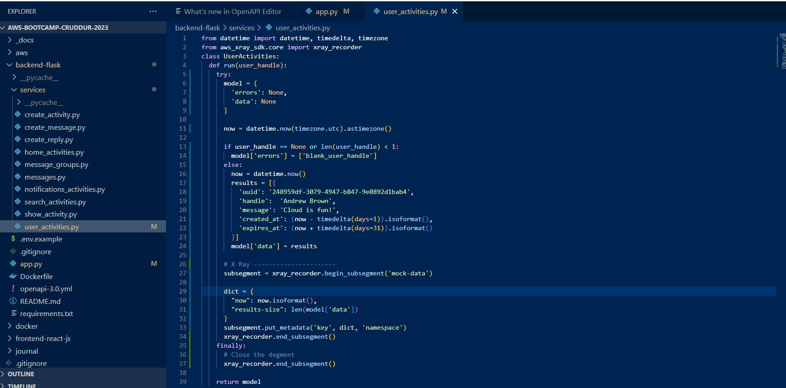

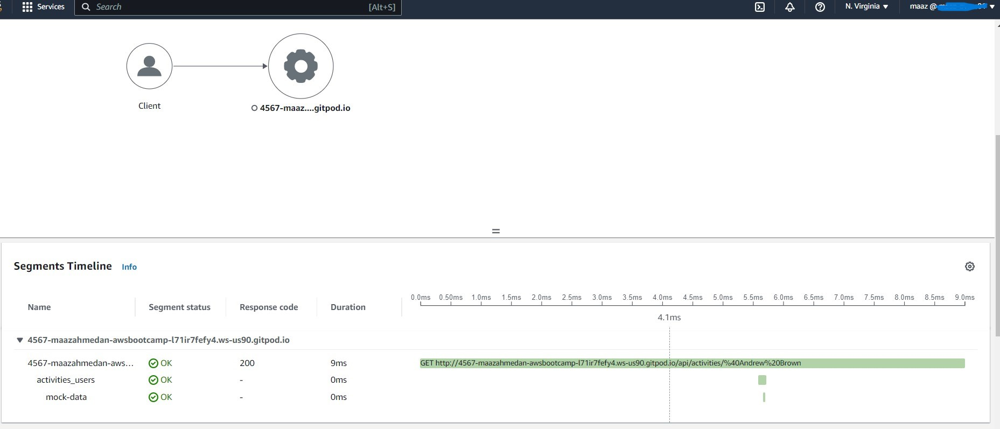

## Configure custom logger to send to CloudWatch Logs

- Configure CloudWatch logs

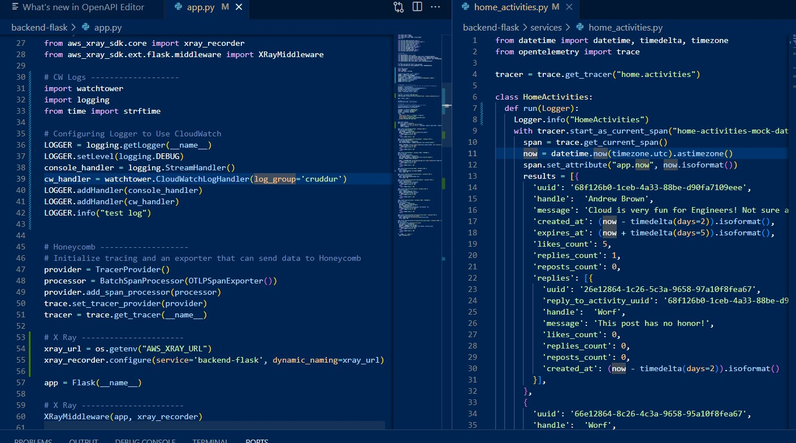

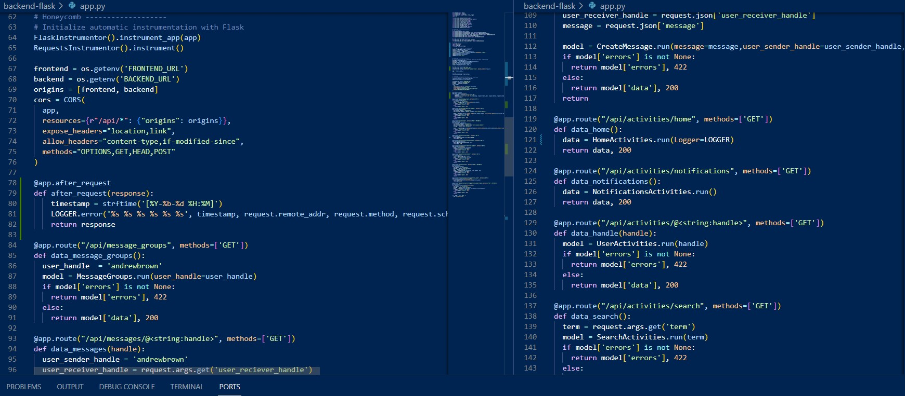

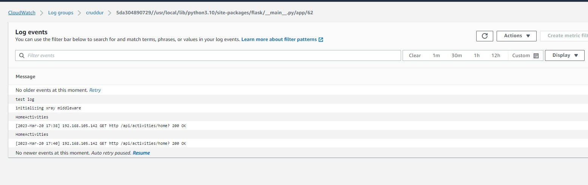

## Integrate Rollbar and capture and error

- Instrument Rollbar and Logging in Rollbar UI

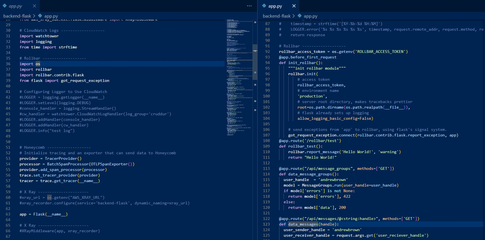

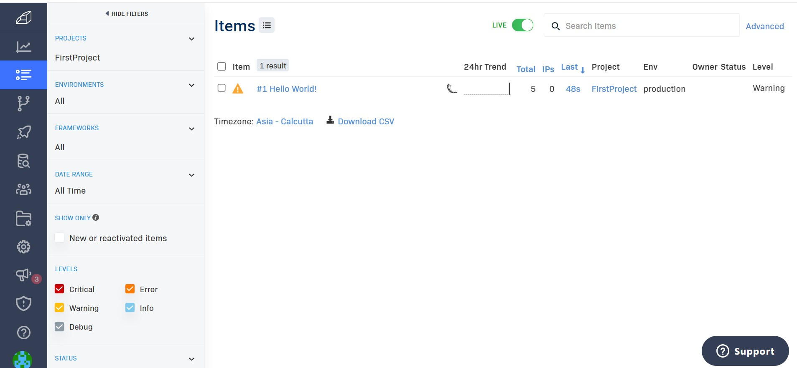

- Mock Error and Log in UI

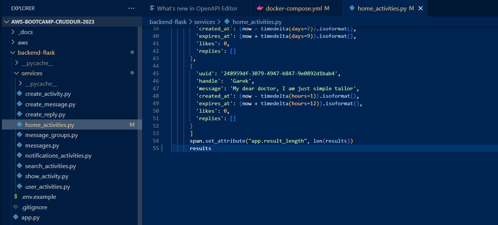

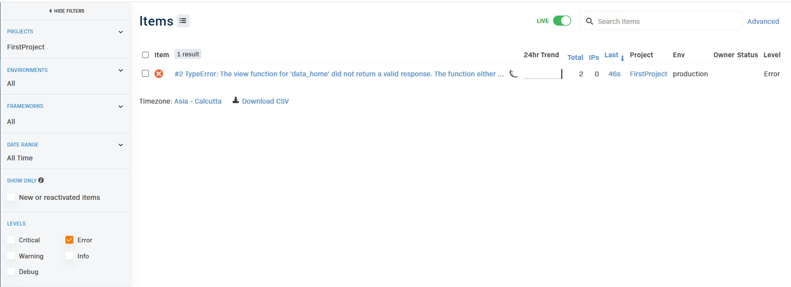

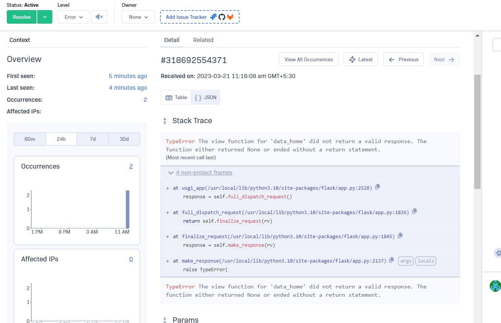
