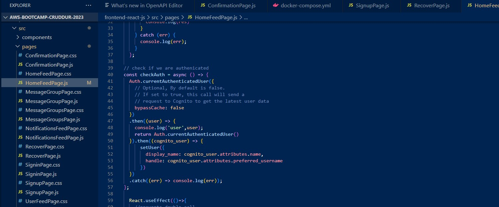
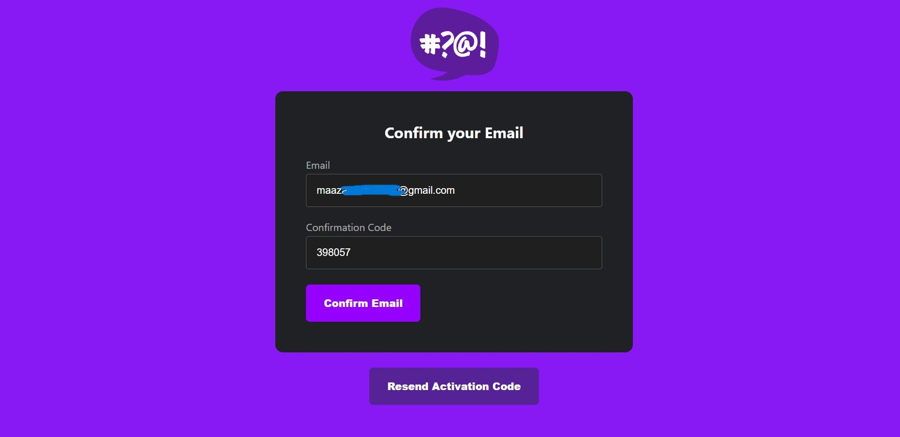

# Week 3 — Decentralized Authentication

## Cognito User Pool

- Cognito User Pool and Users

## Configure AWS Amplify

## HomeFeedPage, ProfileInfo and DesktopSideBar pages Update 

## Implement Custom Signin Page

- Updates in code

- In Cruddur after Sign In

## Implement Custom Signup Page

- Updates in code

- In Cruddur

## Implement Custom Confirmation Page

- Updates in code

- In Cruddur

## Implement Custom Recovery Page

- Updates in code

- In Cruddur

## Verify JWT token server side

- JWT access token and Authenticated request

## Updated Frontend UI

